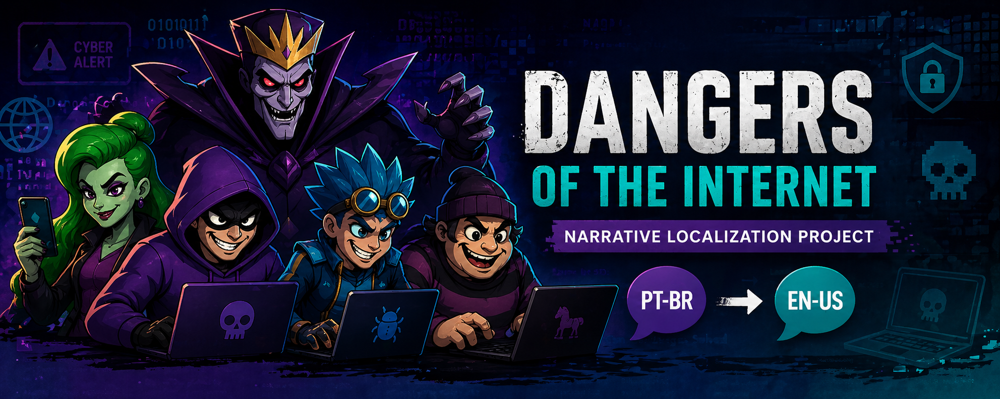

# Dangers of the Internet — Freelance Narrative Localization Project

  

  
  
  
  

---

## 🎯 Overview

Freelance localization project completed for a Brazilian edtech/gaming startup, focused on adapting dialogue-driven educational entertainment content from Brazilian Portuguese (pt-BR) into American English (en-US).

The project blended storytelling, internet safety awareness, and character-based scripting. The objective was to deliver a natural, engaging English version while preserving the original educational intent, humor, and distinct character personalities.

---

## 🛠️ Project Scope

- **Client:** GameBlox (Brazil)  
- **Engagement Type:** Freelance Contract  
- **Source Language:** Brazilian Portuguese (pt-BR)  
- **Target Language:** American English (en-US)  
- **Content Type:** Narrative dialogue / educational game content  
- **Formats:** Editable scripts, review files, and XLIFF localization packages  
- **Audience:** Youth / family-oriented digital audiences  

---

## ✍️ My Contributions

### 🌍 Localization & Adaptation

- Localized scripted dialogue into fluent, audience-friendly en-US.
- Adapted humor, idiomatic language, and tone for cultural relevance.
- Reworked literal phrasing into natural spoken dialogue.

### 🧠 Contextual Analysis

- Created character notes to guide localization choices.
- Built speaker profiles to maintain consistency across scenes.
- Used narrative context to improve translation accuracy and tone alignment.

### 🎭 Character Voice Preservation

- Maintained distinct personalities across recurring villain characters.
- Adjusted vocabulary, rhythm, and intensity based on speaker traits.
- Preserved comedic, dramatic, and instructional moments.

### ✅ Editorial Review

- Reviewed grammar, punctuation, consistency, and readability.
- Ensured terminology alignment across recurring digital safety themes.
- Improved pacing and flow of multi-character conversations.

---

## 🌍 Selected Localization Samples

### 🎭 Character Voice & Tone Adaptation

**Source (pt-BR):**  
"Legal! Achei uma pasta lotada de vírus antigos."

**Localized (en-US):**  
"Cool! I found a folder packed with old viruses."

**Why it Matters:**  
Used *packed with* to strengthen the playful villain tone while keeping the line natural and energetic.

---

### 😈 Personality Through Word Choice

**Source (pt-BR):**  
"Oba! O que você está esperando? Vamos usá-los agora mesmo!"

**Localized (en-US):**  
"Awesome! What are you waiting for? Let's use them right now!"

**Why it Matters:**  
Selected wording that better matched the character’s mischievous excitement rather than a more childish equivalent.

---

### 🌐 Inclusive Natural Language

**Source (pt-BR):**  
"Com isso, acesso com tranquilidade a conta bancária dela."

**Localized (en-US):**  
"That way, I can easily access their bank account."

**Why it Matters:**  
Used singular *their* for natural modern English usage and neutral reference handling.

---

## ⚡ Localization Challenges Solved

- Preserving humor and character personality across languages  
- Differentiating multiple speaker voices consistently  
- Balancing entertainment tone with educational messaging  
- Maintaining terminology consistency in cybersecurity topics  
- Adapting content for youth-friendly English readability  

---

## 🧰 Tools & Workflow

- XLIFF localization workflow (MemoQ)  
- Manual linguistic QA review  
- Context notes & annotations (Microsoft Word)  
- Terminology consistency checks  

---

## 🧠 Skills Demonstrated

- Localization Editing  
- Narrative Translation  
- Proofreading & Linguistic QA  
- Tone Adaptation  
- Character Voice Preservation  
- Terminology Management  
- Cross-Cultural Communication  
- Audience-Focused Writing  
- Attention to Detail  

---

## 🚀 Key Takeaways

This project highlights my ability to localize narrative content beyond direct translation. It required editorial judgment, character voice consistency, and audience-aware language choices—valuable strengths for localization, gaming, entertainment, and brand-focused content roles.

---

## 🔒 Portfolio Note

Only selected excerpts are included to respect client confidentiality while showcasing workflow, editorial process, and localization decision-making.
